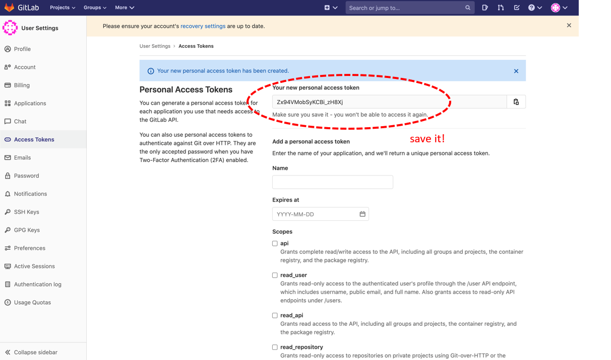

In order to set up your Gitlab plugin to work you will need to authenticate to Gitlab.

You need to have an account on public Gitlab.com service to continue.

Follow the instructions on this screenshot:

When you succeed you will see only one time the Access Token:

Copy it and store it in a text file in a secure location.
